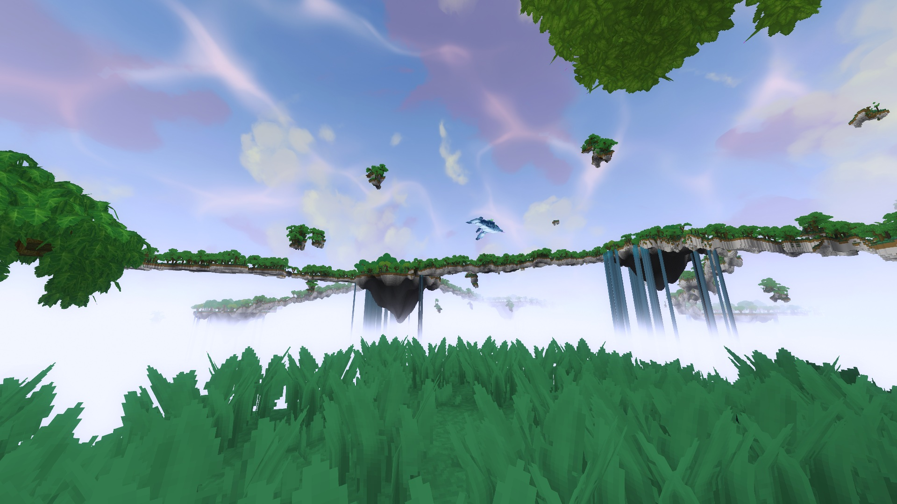
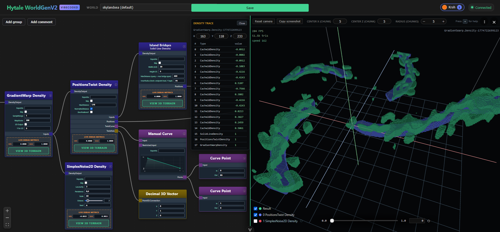

# Skylandsᴇᴀ + Node web editor

Created for the Hytale New Worlds modding contest and learning experience for WorldGen v2.

This project comes with an **optional** custom WorldGen v2 node editor including comments, descriptions and explanations.

Feel free to use this as a starting point for your own projects or as learning material.
I know that it's not the most impressive in terms of artistic vision, but I simply ran out of time as the technical side pretty much kicked my ass. My focus was understand how world gen works and how I can bring concrete ideas (in this case floating islands) into virtual reality.

# Usage of AI

All the code is created with AI due to time constraints. Boycott it or not, I don't care. I see AI as a tool which has it's uses, especially in prototyping. But here is a short run-down of my personal view:
- My time is severely limited, mostly due to my day job
- Hytale server source has not yet been released. Decompiled code is not fun to read & there are no official APIs. As far as I have seen, a lot is also to change as many systems need to be reworked, which afaik, is what the Hytale team is currently doing. So investing a large portion of my time into it makes no sense. But the java part is lightweight anyway, except for that one custom node.
- My last website is 9 years ago and learning how to do one properly is a project in itself. But I see no reason for creating a GUI other than web nowadays. Except if you want me to do it in AWT or Swing? ;)
- I'm not even sure what I wanted/needed in the beginning.

All art assets are stock Hytale. There is a whole Skylands weather and skybox that I could use. Thank you Hytale devs!

# How to run

## Hytale ready jars can be found on CurseForge

No release files on GitHub as downloads count to 10% of contest score and curseforge will be the main place for hytale mods for a long time. I recommend building the project yourself anyway.

https://www.curseforge.com/hytale/worlds/skylandsea

## Prerequisites

### Java
I personally use IDEA IntelliJ. The community edition is fine. See the official java and server setup: https://hytalemodding.dev/en/docs/guides/plugin/setting-up-env

Used for
- `skylandsea-plugin`
- `worldgen-web-editor-plugin`
- `worldgen-custom-nodes`

### Node + NPM + Vue
I personally use IDEA WebStorm. Community edition is fine here as well. See the readme as I honestly have very little experience with it. I'm fighting this thing every day and I would love to know why everything got so complicated over the years and why the dependency file is over 7000 lines long.

- **Node**: `^20.19.0` or `>=22.12.0` (see `worldgen-web-editor/package.json` `engines`). `npm` on `PATH` (Windows: `npm.cmd` for Gradle).

Used for
- `worldgen-web-editor`

### Hytale
I'm on Windows OS.

- **Hytale**: Resolved and used by Gradle. `HytaleServer.jar` under `%USERPROFILE%\AppData\Roaming\Hytale` (Windows), or set `-Phytale_home=...` / `hytale_home` in `gradle.properties` for other OS

## Overview and setup

### Single folder structure
Clone the repo into a single folder. The modules are referencing each other by going up one folder via /../

| Directory |                                                                                                                                                                                  |
|-----------|----------------------------------------------------------------------------------------------------------------------------------------------------------------------------------|
| `skylandsea-plugin` | Hytale java plugin. Depends on `worldgen-custom-nodes` which is packaged into the jar.                                                                                          |
| `worldgen-web-editor-plugin` | Hytale java plugin. Webserver served on port 15009 (default). Embeds `worldgen-web-editor` into the jar. Optional dependency on `de.krah.skylandsea:SkylandseaPlugin`. Depends on `worldgen-custom-nodes` which are packaged into the jar.  |
| `worldgen-web-editor` | Node Web editor (Website) - Vue 3 + Vite UI                                                                                                                                      |
| `worldgen-custom-nodes` | Java library: Custom WorldGen v2 nodes. Used by `skylandsea-plugin`, `worldgen-web-editor-plugin` and independently in `worldgen-web-editor`                                                                   |

### Build Hytale ready release jars

Use the `build` gradle task in `skylandsea-plugin` and `worldgen-web-editor-plugin` to create the respective java Hytale plugin jars. These are to be put into the mods folder each on their own

### Run development

The `skylandsea-plugin` should auto-build run configurations from gradle when the project is opened the first time in IntelliJ. Select a run configraiton at the top. There should be two entries:

**HytaleServer (Skylandsea):** Is the pure Skylandsᴇᴀ plugin. It auto starts a Hytale server which you can connect to via localhost. Make sure to start the idea run configuration and not the gradle run task, as you need to auth the server. If you use the gradle task, the console won't take commands. See `Authentication` on the official Hytale docs: https://support.hytale.com/hc/en-us/articles/45326769420827-Hytale-Server-Manual

**HytaleServer + WorldGenDebugger (Skylandsea):** Starts a Hytale server with both the Skylandsᴇᴀ and the `worldgen-web-editor-plugin` (referenced by jar, so build it first). **Note:** Start the web editor from the `worldgen-web-editor` folder inside WebStorm and have it both run at the same time.

# Skylandsea

I developed Skylandsᴇᴀ completely in the node web editor and I recommend using it due to custom nodes, spacing, comments etc. It also comes with cool features :)

You can find all the comments in the file near the respective nodes themselves (a few days after the contest).

If you want to open it the normal node editor, it should work but I only tested it once or twice. You can find the custom json files json files in `worldgen-web-editor` to put them next to the original ones. But spacing will be off as the web editor nodes are high as opposed to being wide

# Node Web Editor

Accessed via http://localhost:5173/ when running dev. Standalone is the same port as the plugin on http://localhost:15009/

`worldgen-web-editor-plugin` port is 15009 by default.

**In the official Hytale Q&A from 21.4.2026, the devs said that they are developing a new node editor that is built into the game and ismoddable. So I won't pursue any continued development. But in the meantime it should prove useful.** 

## But, why?
The problem at first was, that I just could not wrap my head around how the world generation works. Something with density above and below 0. So I did what every one of you should do: Develop your own tools if the existing ones are not sufficient. And the original node editor just didn't cut it. With AI it pretty easy to get something going fast even if it breaks constantly. It doesn't need to be perfect.

The first idea was to see what the min/max values of specific density nodes are. So I added that first. After that I realized that switching between Hytale and the editor is tedious & time-consuming and I could just vibecode a quick 3D view of the density as a mesh in the browser itself, as I'm only interested in the density being solid or not. A A nice addtion was the ability to shift around 0 to see what happens when the densities go higher or lower.

Next up: `How are single values being calculated?`. Solution was to add a density trace. Shift click on a 3D density mesh to see the trace of a voxel density calulcation.

This was enough to get me going and I could iterate fast enough for the few hours I had here and there. I tried to visualize density with colors but that failed as the mesh is optimized and I have no idea how to do that properly. But this is easily done with tints so it's not a big loss.

## Features

### Collaboration
You can edit a file with multiple people at once and see where they are.

This is a quick vibecoded thing I added and was barely used. Therefor I didn't really put much effort to debug and fine tune it. It may contain bugs.

When run as standalone Hytale mod, a JSON config file will be generated inside the mods folder next to the jar to enable LAN access.
When running dev it's always active, on the standalone plugin it's disabled by default.

### Edit single biome file
Select the world from the server and it will auto-load the corresponding file. This is the same mechanism as the asset editor. Hytale will reload assets when they change on the file system. Use /viewport ingame or the 3D preview. Note that only a single biome file right now can be edited that is configured inside the world structure json.

### Debug values of min/max on density nodes
Minimum and maximum density values are listed after a generation.

### 3D preview in the browser
- Click on the green button on a density node to open the 3D view
- Press H for help/controls
- Click into the 3D to fly around with WASD, C (down) and space (up). Use mouse wheel to speed up / slow down flying
- Select origin and chunk extends at the top
- Use layers on bottom left to overlay with the current node (Result) and input nodes
- Shift-Click on the 3D mesh to show the trace of the values being calculated

### Sliding density breakpoint
Move the density break point at the bottom of the 3D view to change 0 being solid / not solid. Useful without having to adjust the nodes themselves.

### Node features
- Double click on a node name to enter a custom name
- For groups there is a lock icon in the top right

## Know issues/bugs
- When graph is not loading on the web page, reload. Sometimes it bugs out when connecting
- Anchor densities are incorrectly placed at 0/0
- Saving reloads the file form the server, resetting your view and changes
- Performance when saving/loading is not good. My guess is that the json tree is completely rebuilt every time.
- Custom Nodes should be its own plugin to support third party mods
- As a last minute quick fix I had add the custom nodes to the node editor plugin. The custom nodes should be it's own plugin eventually.
- It's vibecoded, keep that in mind. Stuff may not work as intended or break
- Probably forgot stuff

# Custom nodes
There are several custom nodes. I really tried to understand the existing nodes and how they work. This basically ate most of my time. And during the contest, some nodes even changed. Initially I was against using custom nodes, but the amount of deprecated ones tells me that the Hytale developers themselves are currently figuring out what works and what not. You can see that my later custom nodes fit more into the modular idea as my grasp of how the nodes work increases.

Listed in chronological order by creation so you can understand why I added them.

## Features

### DeterministicRandomPositions
The first node. At the start of the contest, there was a Jitter3D Points node or something. The problem was, that the performance was so, SO bad that I had to create a new node.
This was fixed during the contest with the `SquareGrid3D Positions`, `Jitter3D Positions` and `Scaler Positions`. So in theory ,it could be replaced with the exception for the jitter magnitude that I need for different axis. Best be solved with a custom `Jitter3D Positions` that inputes `Decimal 3D Vector` and a checkbox for when the magnitude should be a multiplier or fixed coordinates. For now the node works, but it's something to clean up eventually. 

### DensityYOffsetPosition
As the bridges can't get to steep, the islands can not be far apart in terms of height. But for visual difference, far away islands should a visual altitude change. The input is a density field so I could use a gradual high and low areas via `SimplexNoise2D`. In the end it didn't do much, as the height limitation of 320 caused issues by cutting off islands. It was a neat idea though. Also, the Hytale devs are currently working on unlimited world height, so it's something to look forward to.

### SolidLineDensity
This one is the most important. The requirement of the contest was `walkable` terrain. Great when the whole idea is based around floating islands and no way of flying between them. So bridges were needed. Could any node do that..? No. This was the first real barrier and a headache as well as the spot where I learned how the nodes are interacting with each other. I'm not good with math for a performant line algorithm, so I let opus write the node. If you take a look inside, yeah I have no idea how it works. But it's performant so it's fine for now. For long term I would certainly need to revisit it, as I don't really know what it's doing and I have a feeling it's using some kind of cache which may lead to memory leaks. So it's not really production safe? But so far it seems to not cause a problem and works.

### ClosestPositionProvider
This is special for the Skyland theme. The PCN (Position Cell Noise) get a list of positions and calculate the closest. Since this is done for every voxel inside the density range, a single cached position for all island points is sensible here. It also makes it easier to know what the PCN is referring to.

### YOverridePositionsProvider
That one is a crux. I had trouble to identify where an island is when placing props. The biggest problem is that the PCN from the terrain stage can not be used for the prop generation stage. So I had to hack the height to a fixed 160 for the PCN search. It's a small node but crucial to fixing a problem and certainly a hack that needs to be fixed with unlimited height worlds.

## Performance
I had some problems. Big problems. I developed on a 9800X3D on which chunk generation was ` bearable` . Slow, but I could work with it. When I checked on an 11-year-old CPU, it managed to generate a single chunk in 2 minutes.

My fear was that it had something to do with the custom nodes since I couldn't fathom the original nodes being performance heavy. The only sensible way to solve this is by profiling the actual code and world generation. I used https://visualvm.github.io/ to sample the hotspots. It's clunky to use but Hytale is supporting it without any configuration. You start the server, and it appears in the process list. I sampled CPU during world gen and exported it as a csv. Normally I use the IntelliJ profiler, but that requires the $200 Ultimate version which I only have at work. Yeah, no. I don't have that kind of money.

The next part was fixing. Problem is that this could eat weeks of my time which I didn't have. But the trick here is to know what kills performance. In short:
- Java can be fast
- CPUs are fast when working in batches
- CPU cache misses kill performance as well as pipeline flushes
  - There is a great stackoverflow about pipeline flushes which I recommend: https://stackoverflow.com/questions/11227809/why-is-conditional-processing-of-a-sorted-array-faster-than-of-an-unsorted-array
- SIMD is magic (look it up)

There are several problems. The most egregious one is, that we do not work in batches. We work 1 voxel (x/z and then top to bottom) and then along the nodes. We do not take a bunch of voxels and execute the code of one node at a time with a bunch of data. This kills SIMD too (which modern compilers try to do automatically).
So performance will never be really great with this design, but it should not be `this` bad. 

So I used AI with a lot of hope, specifically a high thinking/expensive model. In my case Opus. I fed it the CSV with the hotspots, decompiled server code as well as the `Skylands.json` with the nodes. It followed the nodes, the code and traces how it's being used. I can do this too but not in 10 minutes for $2. And it worked suprisingly  well. This was a real time saver and one of the best uses of AI I have seen yet.
As it turns out, it's the caches that killed performance. I'm not going into detail, as I only got it by proxy from opus but the short version: There is a `MultiCache` node which is algorithmically using a non O(1) cache when the cache size is larger than 1. I used two with a size of 3 which resulted in `MultiCache.find()` method to be 56% of all required processing power during world gen. And the cache wasn't event hitting cached values most of the time.

Reducing the cache size to 1 and eliminating one of the caches made it 3 times faster. Just one number change and deleting one node. Caches are only good when it takes longer to calculate the value than looking it up. So calculating a number can be faster than storing. It's just very tricky to know when that is the case. In this case we use a node system which calls methods and other nodes so on. Knowing exactly is happening is a time consuming task. So measuring is one of the fastest methods, especially on unoptimized code that still has a lot of low hanging fruits left.

Next up was the built-in cache of the `DensityReturn` type. Since I'm using them with a constant density of 0 for the choice density, the internally used cache makes zero sense. I'm most certainly I'm using them incorrectly right now (but hey, it works). That's where the `FastDensityReturnType` is used. The original assets are being built together with other nodes internally so it's easy to build your own. The original adds a cache to the pipeline which this version doesn't have.

The next part is the cache in `SimplexNoise2D`. I'm not sure what was the exact problem, but the warping and twisting of the bridge from the `SolidLineDensity` kills the built-in cache that is baked into `SimplexNoise2D`.

I had 9 rounds of sampling and debugging in the same context. Opus managed to reason what was faster and why, as well as stuff like `My cache is not working, as the node behind is hit the same amount as the cache itself` between rounds which made it reevaluate and implement something that worked. That I found impressive. Eventually it build the `Cache2dDensity` which apparently fixes some case of a cache miss with the y-axis. I would have to get more into it, but time is not on my side, and it's not a problematic area that needs attention right now.

In the end, cache hits couldn't be fond anymore under the first 100 hotspots and the simplex noise algorithm itself was the biggest performance eater. This is what it should look like. I added FastNoiseLite for a few percent (did less than I anticipated, something around 1-6%). Right now the simplex noise algorithm sits at 53%.

I was after low-hanging fruits especially and I got them. This was a ~6-hour session with around $15 worth and a magnitude of something between 15x-35x faster generation. A complete success for something that I had little time for but could disqualify me in the contest.

It should now generate chunks even on old laptops in reasonable time.

# How I work

As mentioned before, I'm severely limited in time as my day job as a professional software developer. And since I need to learn how to use AI anyway (it won't go away, lets be real), I'm trying to use it properly.

I use Cursor AI as I find it being useful and it cost me around $40 for this project across the two months.

The root folder I fed cursor to includes all the modules above, the decompiled Hytale server source and the asset folder. It was a tremendous help, as I could point to the `Skylandsea.json` file and explain my problem. It scanned the folder, checked against the source code of the original implementation of nodes and told me why certain values are coming in. It also has the ability to analyze images that often resulted in a 'good enough' answer that would pivot me in the right direction. Thats what the "Copy screenshot" button in the 3D view is for.

Asking AI worked out 10% - 50% of the time. But it still helped a lot, as I didn't need to scour the source code myself and I could puzzle the pieces together. Especially the anchors and/or optional nodes are just not feasible to understand without reading the implementation. Also knowing that a mix node needs three inputs is just diabolical or that missing seeds in weighted prop nodes cause every weight entry to have the same random seed.

# Future
Since I plan to continue doing world gen, I would have shaped the node editor into a proper product, but I won't continue this project mostly due to the Hytale devs doing their own, more integrated version. Also asking AI to add features just breaks other features and there a minimal amount of architectural design and requirements/tests required for it to not do that that it would equal redoing it. Using AI properly is pretty difficult in my opinion. Reading and understanding code, explaining certain small things are great. But letting it create code in a scalable manner is the real challenge. Also, cheap models are doing only doing minimal work, makes the code break even faster as everything is just shoved in somewhere and I used them a lot here.

Feel free to use this as you please and expand on it if you want. Have fun :)
